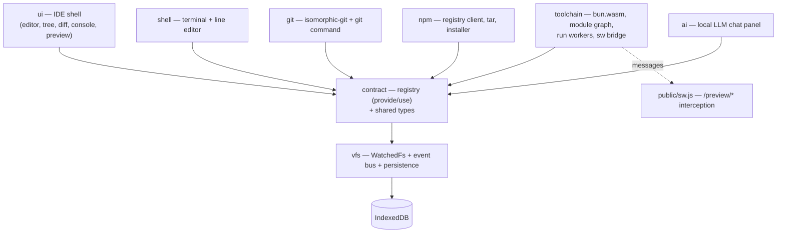
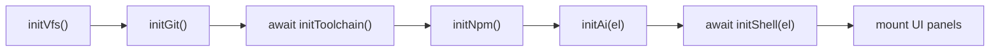
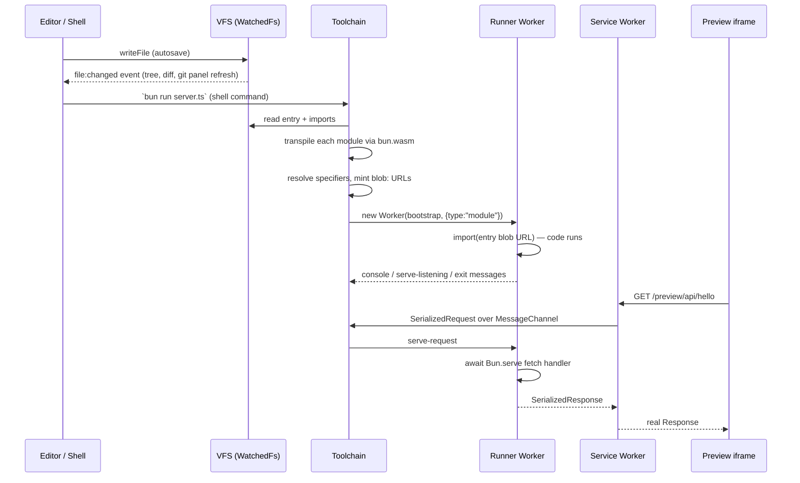

# Architecture

Burrow is a Bun dev environment that runs entirely in a browser tab. There is no
container, no remote VM, and no server-side execution: the dev server
(`server.ts`) only serves static assets and proxies git traffic.

## The core idea

Burrow does not emulate a CPU or ship a JavaScript engine. Your code runs on the
**browser's own JS engine**, inside Web Workers. What makes it feel like Bun is:

- **Real Bun transpilation.** `bun.wasm` is Bun's actual Rust transpiler
  compiled to WASM (loaded behind a small hand-written WASI shim in
  `src/toolchain/wasm.ts`). TS/TSX/JSX becomes plain ESM the browser can run —
  with the same output real Bun would produce.
- **Everything around the engine is virtualized.** The filesystem is an
  in-memory VFS (persisted to IndexedDB), the shell is just-bash, git is
  isomorphic-git over the VFS, npm installs are done by fetching tarballs from
  the registry directly, `Bun.serve` HTTP servers are reachable through a
  service worker, and Node builtins are shims.

So the pipeline for running a file is: read from the VFS → transpile with
bun.wasm → link modules as `blob:` URLs → `import()` in a dedicated Worker.
No eval-in-page, no bundler round trip through a server.

## Module map

Modules live under `src/`. Each one owns a vertical slice and talks to the
others only through the contract layer (`src/contract/`).



**`src/vfs/`** — the filesystem spine. One just-bash `InMemoryFs` wrapped in
`WatchedFs`, a decorator that emits a `file:changed` event on every mutation.
The *same instance* backs the shell, the editor, git, and npm, so every write
from any source hits one store and one event bus. Also owns the typed
`EventBus`, a `GitFsAdapter` exposing the exact promise-fs surface
isomorphic-git needs (error `.code`s, stable inodes, git mode bits), IndexedDB
snapshot persistence (debounced full-workspace saves, restore on boot), and
demo-content seeding. Provides `events`, `vfs`, `gitFs`; registers the
`workspace` command.

**`src/git/`** — isomorphic-git 1.38.7 over `gitFs`, a Buffer polyfill
(isomorphic-git assumes a `Buffer` global), a `GitAPI`
(clone/init/status/stage/commit/log/discard/headContent), a hand-rolled Myers
unified-diff renderer, and the server-side `/git-proxy` handler that lets the
browser speak smart-HTTP to real remotes despite CORS. Provides `git`;
registers the `git` command (nine subcommands; clone is shallow, and there is
no push/pull/branch-switching yet).

**`src/toolchain/`** — the in-browser Bun runtime. Lazily loads `bun.wasm`,
builds an ESM module graph from the VFS (extension probing, JSON modules,
`node_modules` resolution with exports-map support, esm.sh fallback for
uninstalled packages, CommonJS facades with a synchronous `require`, ~40 Node
builtin shims), mints `blob:` URLs, and executes the entry in a dedicated
Worker per run session. Also owns the page side of the `/preview` bridge and
hot reload (a new worker boots alongside the old one and is only promoted once
its server is listening). Provides `toolchain`; registers `bun` and `serve`.

**`src/npm/`** — a browser-native package manager. Resolves dependency graphs
against registry.npmjs.org, downloads and gunzips tarballs, extracts them with
a hand-rolled ustar parser, and lays out a flat-hoisted `node_modules` in the
VFS with a lockfile (`burrow-lock.json`) that makes fully-locked installs
replay with zero registry metadata fetches. Provides `npm` (via module
augmentation — see below); extends the `bun` command with
`install`/`add`/`remove`. Tarball integrity (npm SRI) is verified via
`crypto.subtle`; no lifecycle scripts and no bin linking yet.

**`src/shell/`** — the interactive terminal: a WTerm widget mounted over a
DOM-free `ShellDriver` implementing a readline-style line editor (history, tab
completion, Ctrl+C/A/E/U/W/L) on top of just-bash. just-bash resets shell
state on every exec, so the driver threads `{cwd, env}` into each command and
reads them back — that is how `cd` and `export` persist. Provides `shell`;
registers `edit` and `open` (which emit `editor:open` for the UI).

**`src/ai/`** — a local-LLM chat side panel. transformers.js +
onnxruntime-web are bundled server-side into a same-origin module worker that
runs a small model (Qwen3-0.6B by default) on WebGPU; weights download
straight from huggingface.co and cache in the browser. The panel streams
tokens, folds `<think>` blocks, and can inject the active editor file as
context. Provides `ai`. Degrades to a disabled state without WebGPU.

**`src/ui/`** — the IDE shell and boot orchestrator (`main.tsx`): CodeMirror 6
editor with debounced autosave, file tree with CRUD, git diff panel, console
feed, preview iframe, status bar, run/stop transport, resizable panes. Owns
`index.html`, `server.ts`, and the build plumbing. Provides nothing — it is a
pure consumer of the registry and event bus.

**`src/vm/`** — a **design-only stub**. It contains a single design doc
(`DESIGN.md`) with a proposed type contract for a planned v86-based Linux VM
(serial console, disk persistence, guest TCP port bridge) and nothing else: no
implementation, no tests, no wiring into the registry. Ignore it unless you
want to build it.

**`src/contract/`** — the seam everything above plugs into: `types.ts` (the
complete cross-module type vocabulary — VFS surface, git fs contract, event
map, runner protocol, AI worker protocol) and `registry.ts` (the service
locator). These files are frozen by convention; modules adapt to them, not
vice versa. `CONTRACT.md` at the repo root is the long-form version.

## The contract pattern

Cross-module access never happens via direct imports (with three sanctioned
exceptions: `src/ui/main.tsx` importing the init entrypoints, `server.ts`
importing the git proxy handler, and anything importing `src/contract/*`).
Instead, `src/contract/registry.ts` is a tiny typed service locator:

```ts
provide("vfs", watchedFs);      // once, during the owning module's init
const vfs = use("vfs");         // throws if called before that init ran
const ai = tryUse("ai");        // undefined instead of throwing — for optional features
```

`provide` throws on double-provide and `use` throws on use-before-boot, so
ordering bugs fail loudly at startup instead of surfacing as `undefined` later.
The `Services` interface in `types.ts` types the keys; a module can add a key
additively via TypeScript module augmentation without touching the contract
files (this is how `npm` registered itself).

Shell commands use the same collection point:

```ts
registerShellCommand(spec);     // during module init
sealShellCommands();            // shell module only, at Bash construction
```

The shell drains the list into just-bash `customCommands` and seals it —
registering after the shell boots throws. Commands with the same name follow
just-bash's last-registration-wins rule, which is exactly how `src/npm/`
extends the toolchain's `bun` command with `install`/`add`/`remove` while
delegating everything else back to it.

Beyond the registry, modules coordinate through the event bus (`events`), whose
vocabulary is closed and defined in `types.ts`: `file:changed`, `fs:batch`,
`cwd:changed`, `editor:open`, `run:started`/`run:ended`/`preview:ready`. The UI
is almost entirely event-driven — e.g. the file tree rebuilds on
`file:changed`/`fs:batch` regardless of whether the write came from the editor,
the shell, git checkout, or an npm install.

## Boot order

`src/ui/main.tsx` executes a fixed sequence, because `use()` requires
providers to exist and the command registry seals when the shell constructs
Bash:



- `initVfs` is **fatal** if it fails — nothing works without the filesystem.
  Every other step degrades gracefully: a failed module is reported in a
  banner and its feature is missing, but the rest of the IDE mounts.
- `initToolchain` registers the service worker; `bun.wasm` itself stays lazy
  until the first transpile.
- `initNpm` must run after `initToolchain` (so its `bun` spec wins
  last-registration) and before `initShell` (which seals commands).
- `initAi` mounts the panel but defers the model download until the user asks.

## How execution works, end to end

What happens between saving a file and seeing an HTTP response in the preview
pane:



Step by step:

1. **Save.** The editor autosaves through `vfs.writeFile`; `WatchedFs` emits
   `file:changed` and every interested panel refreshes. Snapshots persist to
   IndexedDB on a debounce, so the workspace survives a reload.
2. **Build.** `buildGraph(entry)` DFSes the import graph: each module is read
   from the VFS and transpiled by `bun.wasm`; import specifiers are extracted
   from the transpiled output. Relative paths are probed with Bun-style
   extension/index resolution; bare specifiers resolve against the installed
   `node_modules` (exports maps, CJS facades, Node builtin shims) and fall
   back to `https://esm.sh/<pkg>@<version>` for uninstalled packages. Modules
   become `blob:` URLs, linked bottom-up by textual specifier rewriting.
3. **Run.** Each run gets a dedicated `Worker`. A generated bootstrap module
   pipes `console.*` and errors back to the host as messages, installs a
   `Bun.serve` shim that captures `options.fetch` and announces
   `serve-listening`, then `import()`s the entry. The host `RunSession`
   buffers events and emits `run:started` / `preview:ready` / `run:ended` on
   the bus.
4. **Serve.** `public/sw.js` intercepts same-origin `/preview/*` requests,
   serializes each one, and posts it to the page over a fresh
   `MessageChannel`. The page-side bridge (`src/toolchain/sw-bridge.ts`)
   forwards it to the active session's worker, which runs the user's fetch
   handler and returns a serialized response (10 s timeout → 504; no active
   server → a styled 503 page). The preview iframe just points at
   `/preview/`.
5. **Hot reload.** Re-running the same entry boots a *pending* worker
   alongside the old one and promotes it only after its server is listening;
   a failed rebuild or crash keeps the previous server serving.

## Known architectural limits

Things that are constrained by the platform, not just unfinished:

- **No raw TCP/UDP.** Browsers only give you fetch/WebSocket, so Postgres,
  Redis, MySQL, etc. clients cannot connect directly — they would need a
  WebSocket relay, which Burrow does not ship. (`Bun.sql`, `Bun.redis`, and
  `node:net`/`node:tls` are absent or throwing stubs.)
- **Same-origin git only via proxy.** Git hosts don't send CORS headers for
  smart-HTTP, so clone traffic must round-trip through the `/git-proxy` route
  on whatever serves Burrow. A purely static deployment has no working clone
  unless something provides that proxy.
- **No native addons or lifecycle scripts.** Packages that compile or download
  platform binaries (esbuild, sharp, better-sqlite3) install but cannot work:
  there is no process to run `postinstall` in and no way to load `.node`
  files.
- **Node builtins are shims.** ~40 modules are reimplemented on browser
  primitives; `fs` in run workers is currently a throwing stub (run code sees
  the VFS only through the module graph, not at runtime), and
  `child_process`/`worker_threads`/`zlib` throw with actionable errors.
- **`Bun.serve` is fetch-only.** The sandbox shim supports `options.fetch`;
  `routes`, `websocket`, and real port binding are not implemented, and all
  servers share the single `/preview/` slot (latest listener wins).
- **Browser memory and storage ceilings.** Everything — VFS, `node_modules`,
  git objects, model weights — lives in tab memory, and persistence is a
  full-workspace IndexedDB snapshot subject to origin storage quota. Large
  `node_modules` trees make both saves and memory pressure noticeably heavier.
- **One tab at a time.** Workspace persistence has no cross-tab coordination;
  two tabs on the same origin will silently overwrite each other's snapshots.
- **Import cycles are a build error.** The blob-URL linking strategy is
  strictly bottom-up, so ESM cycles (common in larger real-world projects)
  currently fail the build rather than being resolved lazily.
